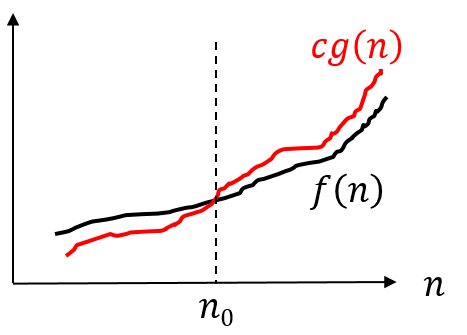
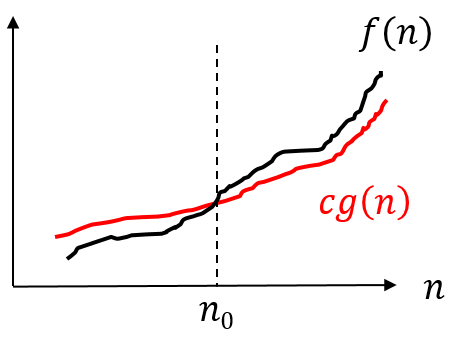

## 시간 복잡도

### 알고리즘 효율성

- 알고리즘의 효율성은 알고리즘이 실행되는 동안에 필요한 컴퓨팅 자원(비용)으로 표현한다.
    * CPU, Memory, . . .

- 효율성이 좋다는 것은 복잡도(complexity)가 낮다는 것이고, 효율성이 나쁘다는 것은 복잡도가 높다는 의미이다.
    * 시간 복잡도와 공간 복잡도가 주로 사용된다.

- 문제의 크기가 커질 수록 비용이 어느 정도 증가하는지를 근사적으로 표현한다.

- 알고리즘의 시간 효율성을 보기 위해 실행 시간을 측정할 수 있다. 

    * 실험적으로 측정 : 특정 입력에 대해 실제 실행 시간 측정
    * 분석적으로 측정 : 입력 크기에 대해 어느 정도의 계산 작업이 필요한지 측정

> 점근적 표기(Asymtotic Notation)

- 알고리즘의 실행 시간은 분석적으로 측정해서 시간 함수를 구해서 점근적으로 표현한다.
- 함수들의 집합을 정의하는 방법을 사용한다.

> 대표적인 표기 방법:

- Big O :   $O(n)$
- Omega :   $\Omega(n)$
- Theta :   $\Theta(n)$
    
예를 들어, 알고리즘 **A** 가 $O(n^2)$ 이다. 이는, **A** 의 실행시간 함수가 $f$ 라면, $f \in O(n^2)$ 라는 것을 의미한다.
 
--------------------

### Big *O*

- 최악의 경우
- \(O(f(n))\) 집합은 \(f(n)\) 보다 빠르게 증가하지 않는 함수들의 집합을 의미한다. Big *O* 표기는 함수의 상한을 나타내기 위해 사용한다.
- $f(n)$ 에 대한 입력 크기 $n$ 이 (무한히) 증가함에 따라 $f(n)$ 의 값이 얼마나 빠르게 증가하는지 나타낸다.
    - 점근적 증가율(asymptotic growth rate)
   
- 함수 $f(n)$ 이 $O(g(n))$ 의 원소라 것을 표현하기 위해 $f(n) = O(g(n))$ 이라 표기한다.

- $f(n) \in O(g(n))$ 의 의미

   - 모든 $n(n \ge n_0)$ 에 대해 $f(n) \le cg(n)$ 을 만족하는 $c, n_0$ 가 존재한다.
   - $10n + 3 \in O(n^2)$    (O)
   - $n^2 \in O(20n)$ (X)

    

--------------------

#### 자주 사용되는 Big *O* 표기들

다음 표는 자두 사용되는 대표적인 Big *O* 표기법들과 잘 알려진 알고리즘들이다.

| 분류              | 예                |
| ----------------- | ----------------- |
|$O(1)$             |	해싱          |
|$O(n)$ 			     |    순차 검색     |
|$O(\log_2 n)$  	  |    이분 검색     |
|$O(n \log_2 n)$	  |    퀵 정렬       |
|$O(n^2)$			  |    선택 정렬     |
|$O(n^3)$ 		     |    플로이드-워샬  | 
|$O(2^n)$       	   |	부분집합       |
|$O(n!)$ 			|   순열          |
   
--------------------

### *Omega*

- 최선의 경우
- $\Omega(f(n))$ 집합은 $f(n)$ 보다 **느리게** 증가하지 않는 함수들의 집합을 의미한다.  $\Omega$ 표기는 함수의 **하한** 을 나타내기 위해 사용한다.
- $f(n) \in \Omega(g(n))$ 의 의미

   - 모든 $n(n \ge n_0)$ 에 대해 $f(n) \ge cg(n)$ 을 만족하는 $c, n_0$ 가 존재한다.

--------------------

### *Theta*

- 최선과 최악의 경우과 같을 경우에 사용한다. 따라서, Big *O* 로 간주해도 된다.
- $\Theta(g(n)) = O(g(n)) \bigcap \Omega(g(n))$
- $\Theta(g(n))$ 은 $f(n)$ 과 동일하게 증가하는 함수들의 집합

