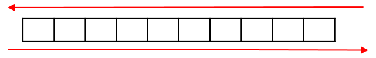
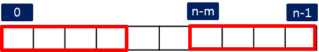
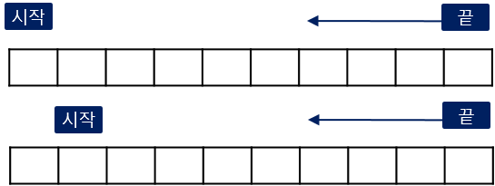

## 1차 배열


### 기본 순회

> 순방향 / 역방향

- 1차 배열의 기본적인 순회는 **0** 번 인덱스의 자료부터 마지막 **N - 1** 번 인덱스까지 하나씩 **순방향** 탐색한다.
- **역방향** 탐색은 마지막 자료( **N - 1** )부터 **0** 번까지 한다.
- **N** 은 배열에 저장된 자료의 수이다.

{: width="60%" height="60%" }

*< 순방향/역방향 >*

#### 예제 코드

다음은 순방향 순회를 for와 while 문으로 작성한 예이다.

<!-- ??? settings "순방향"  -->
=== "python"
    ``` python
    arr = [i for i in range(10)]
    N = len(arr)

    for i in range(N):
        print(arr[i], end=' ')
    print()

    #------------------------------
    # while 문
    i = 0
    while i < N:
        print(arr[i], end=' ')
        i += 1
    print()
    ```
=== "C"
    ``` C
    
    ```

다음은 역방향으로 순회하는 예이다.

<!-- ??? settings "역방향"  -->
=== "python"
    ``` python
    for i in range(N - 1, -1, -1):
        print(arr[i], end=' ')
    print()

    #------------------------------
    # while 문
    i = N - 1
    while i >= 0:
        print(arr[i], end=' ')
        i -= 1
    print()
    ```
=== "C"
    ``` C
    
    ```

-------------------

### 고정 길이 연속 구간


- 길이가 **N** 인 배열에서 길이 **M** 인 모든 구간을 탐색한다. (M <= N)
- **N - M + 1** 개의 구간들이 존재한다.

{: width="60%" height="60%" }

- 각 구간들의 시작 위치는 **0** 부터 **n - m** 까지다.

#### 예제 코드

<!-- ??? settings "고정 길이 구간 탐색"  -->
=== "python"
    ``` python
    arr = [i for i in range(8)]
    N, M = len(arr), 4

    for i in range(0, N - M + 1):
        for j in range(i, i + M):
            print(arr[j], end=' ')
        print()

    #--------------------------------
    # while 문
    i = 0
    while i <= N - M:
        print(*arr[i: i + M])
        i += 1
    ```
=== "C"
    ``` C
    
    ```


!!! info "2차 배열에 응용"

    - N x N 2차 배열에서 M x M 사각 영역 탐색하기

-------------------

### 가능한 모든 길이의 구간

- 1차 배열에서 찾아야 찾아야 할 구간의 길이가 고정적이지 않는 경우에 모든 가능한 길이에 대해서 처리해야 한다.
- 반복문을 추가로 중첩해서 작성할 수 있다.

다음 방법들을 살펴보자.

- 시작위치 고정하고, 끝 위치를 감소시키면서 모든 길이의 구간들에 대해서 탐색한다.

{: width="60%" height="60%" }

- 최초 시작 **0** , 끝은 **N - 1** 로 두고, 끝 인덱스를 감소시킨다.
- 다음으로 시작을 증가시켜서 **1** 로 두고, 끝 인덱스를 **N - 1** 에서 감소시킨다.
- 이런식으로 반복한다.

=== "python"
    ``` python
    arr = [i for i in range(4)]
    N = len(arr)

    for start in range(0, N):
        for end in range(N - 1, start - 1, -1):

            for i in range(start, end + 1):
                print(arr[i], end=' ')
            print()
    ```
=== "C"    
    ```
    ```

- 시작위치를 고정하고, 끝 위치 증가시키면서 모든 구간을 탐색한다.

{: width="60%" height="60%" }

- 최초 시작 **0** , 끝은 **1** 로 두고, 끝 인덱스를 증가시킨다.
- 다음으로 시작을 증가시켜서 **1** 로 두고, 끝 인덱스를 **2** 부터 증가시킨다.
- 이런식으로 반복한다.

=== "python"
    ``` python
    arr = [i for i in range(4)]
    n = len(arr)

    for start in range(0, n):
        for end in range(start, n):

            for i in range(start, end + 1):
                print(arr[i], end=' ')
            print()
    ```
=== "C"    
    ```
    ```

<!-- - 구간의 시작과 끝을 증가 또는 감소시키면서 가능한 모든 구간을 탐색한다. -->
