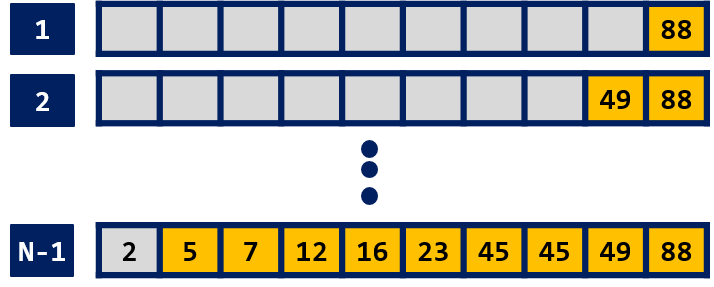
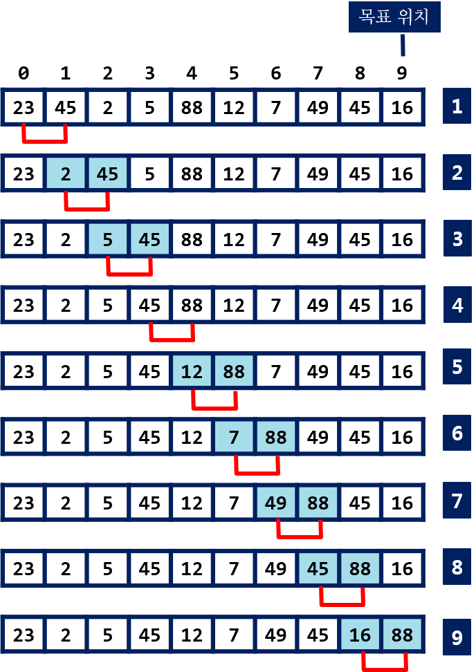
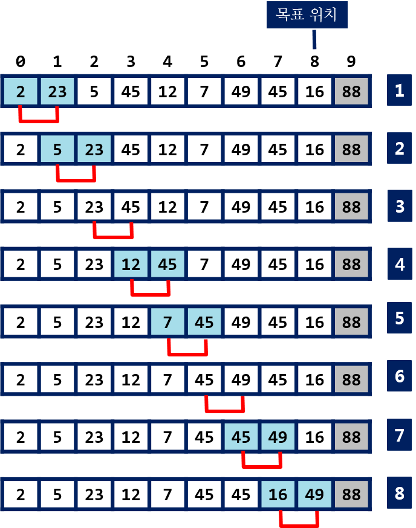

## 거품 정렬

!!! info "시간 복잡도"

    - **최선** $O(n^2)$
    - **최악** $O(n^2)$
    - **평균** $O(n^2)$

--------------
    
수중의 거품이 수면위로 올라가는 것과 같은 모습이라 거품 정렬이라고 한다. 인접한(연속한) 두 자료의 비교와 교환을 통해 정렬을 수행한다.

정렬할 자료 중에 최대값이나 최소값을 시작위치 또는 마지막 위치로 이동시킨다. 오름차순 정렬을 한다면 최대값이 마지막 위치에 자리를 잡게 된다.


{: width="60%" height="60%"}

*<정렬(오름차순)되는 과정>*
   
   
자료가 0번 인덱스에서 n-1까지 저장되어 있다.

{: width="60%" height="60%"}

*<정렬전의 자료들>*
      
   
연속된 두 자료를 비교한다. 첫번째 자료 위치가 **i** 이고, 두번째 자료는 **i+1** 이다.

- arr[i] > arr[i+1] 이면, 두 자료를 교환한다. i+1의 위치에 두 자료중에 큰 값이 위치한다. 
- i를 1씩 증가시키면서 반복한다. 
- 마지막 자료의 인덱스가 N - 1이므로 N-2와 N-1번 자료에 대한 비교/교환을 할 때까지 진행한다.
- 이 과정이 끝나면 최대값이 N-1번에 위치한다.

N-1번에 위치한 값은 최대값이고, 정렬된 상태에서 자신이 위치를 찾은 것이다. 
  
{: width="60%" height="60%"}

*<첫번째 pass: 88이 마지막(N-1)에 위치함>*  
   

이제, 정렬할 자료 수가 하나 줄었고, **0** 부터 **N-2** 번의 자료들에 대해 동일한 작업을 반복 수행한다. 

다음 그림은 두 번째로 큰 값이 **N-2** 번에 위치하는 과정을 보인다.


{: width="60%" height="60%"}

*<두번째 pass: 49가 인덱스 N-2 에 위치함>*  
  
   

계속해서 **N-3** 부터 **1** 번 위치 까지 크기순으로 값을 결정하는 것을 반복하면 정렬이 끝난다.


### 예제 코드

??? settings "Bubble Sort" 
    === "python"
        ``` python
        def bubble_sort(arr):
            for j in range(len(arr), 0, -1):
                for i in range(1, j):
                    if arr[i - 1] > arr[i]:
                        arr[i - 1], arr[i] = arr[i], arr[i - 1]
        ```
    === "C"
        ``` C
        void bubbleSort(int arr[], int size)        // size: 자료의 수
        {
            for (int i = size - 2; i >= 0; i--)	    // n - 1 번 반복
            {
                for (int j = 0; j <= i; j++)        // 인접한 두 요소 j, j + 1 
                {
                    if (arr[j] > arr[j + 1])        // 오름 차순 정렬
                        swap(arr[j], arr[j + 1]);
                }
            }
        }
        ```


