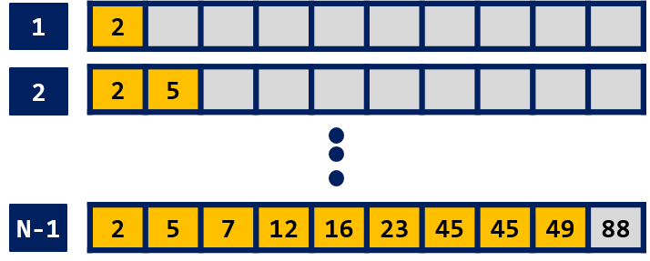
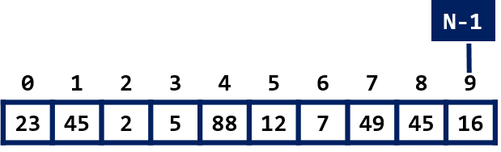
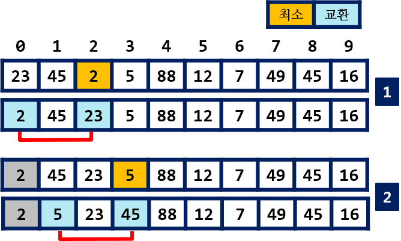
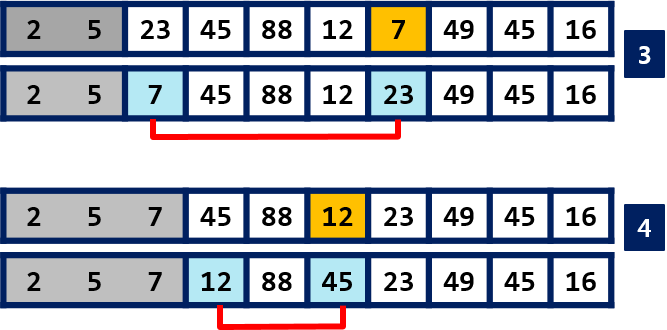
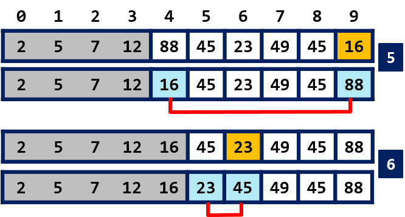
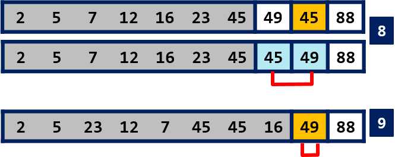

## 선택 정렬 


!!! info "시간 복잡도"

    - **최선** $O(n^2)$
    - **최악** $O(n^2)$
    - **평균** $O(n^2)$

--------------
    
정렬한 자료들 중에 최대값 또는 최소값을 찾아서 앞으로(시작위치) 이동시키면서 자료를 정렬한다.

{: width="60%" height="60%"}

*< 정렬(오름차순)되는 과정 >*


1. **0** 번에서 **N-1** 번 까지 자료들 중에 최소값을 찾아서 0번 위치로 이동시킨다. 

    - 0번 자료와 최소값을 교환한다.
    - 0번 위치로 이동한 최소값은 정렬된 자료에서 자신의 위치를 찾은 것이다. 따라서, 이후 작업에서 배제된다.

2. 이제 **1** 번 부터 **N-1** 번에서 최소 값을 찾아서 시작 위치 **1** 번 위치로 옮긴다. 이를 위해 1번 자료와 최소값을 교환환다.

3. 1, 2를 반복 수행한다. **N-2** 번 위치의 값이 결정되면 정렬을 종료한다.

---------------

{: width="60%" height="60%"}

*< 정렬전의 자료들 >*

10개 자료가 저정된 배열 ``int arr[10]`` 에 대해서 선택 정렬이 진행되는 과정을 살펴 보자.   

{: width="60%" height="60%"}
   
- 1) [0, 9] 범위의 최소 값 arr[2] 를 찾아서 arr[0] 과 교환한다.
- 2) [1, 9] 범위의 최소 값 arr[3] 을 찾아서 arr[1] 과 교환한다.

{: width="60%" height="60%"}   
 
- 3) [2, 9] 범위의 최소 값 arr[6] 을 찾아서 arr[2] 과 교환한다.
- 4) [3, 9] 범위의 최소 값 arr[5] 를 찾아서 arr[3] 과 교환한다.
   
{: width="60%" height="60%"}   
   
- 5) [4, 9] 범위의 최소 값 arr[9] 를 찾아서 arr[4] 과 교환한다.
- 6) [5, 9] 범위의 최소 값 arr[6] 을 찾아서 arr[5] 과 교환한다.   

{: width="60%" height="60%"}   
   
- 7) [6, 9] 범위의 최소 값 arr[6] 을 찾아서 arr[6] 과 교환한다. 변화가 없다.

{: width="60%" height="60%"}

- 8) [7, 9] 범위의 최소 값 arr[8] 과 arr[7]을 교환
- 9) [8, 9] 범위의 최소 값 arr[8] 이므로 변화 없다.

여기까지 진행되면 마지막 arr[9]에는 최대 값이 위치한다. 


### 예제 코드

??? settings "Bubble Sort" 
    === "python"
        ``` python
        def selection_sort(arr):
            for i in range(len(arr) - 1):
                minIdx = i
                for j in range(i + 1, len(arr)):
                    if arr[minIdx] > arr[j]:
                        minIdx = j
                arr[i], arr[minIdx] = arr[minIdx], arr[i]

        ```
    === "C"
        ``` C
        void selectionSort(int arr[], int size)
        {
            for (int i = 0; i < size - 1; i++)	    // 오름차순 정렬
            {   
                int minIdx = i;                     // minIdx = 최소값 인덱스
                
                for (int j = i + 1; j < size; j++)  // 최소값 찾기
                {
                    if (arr[minIdx] > arr[j])
                        minIdx = j;
                }
                swap(arr[i], arr[minIdx]);          // 최소값을 시작위치 i와 교환
            }
        }
        ```
