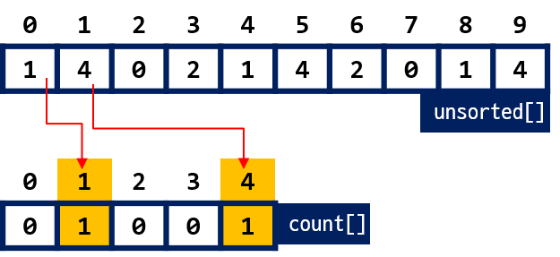
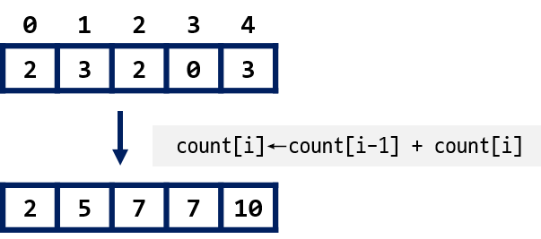
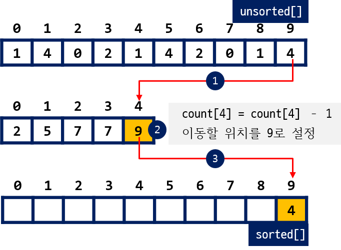
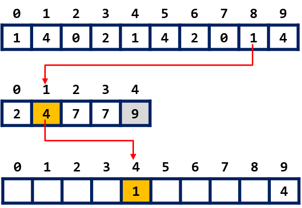
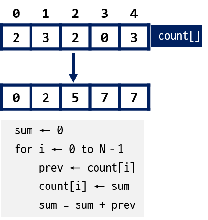
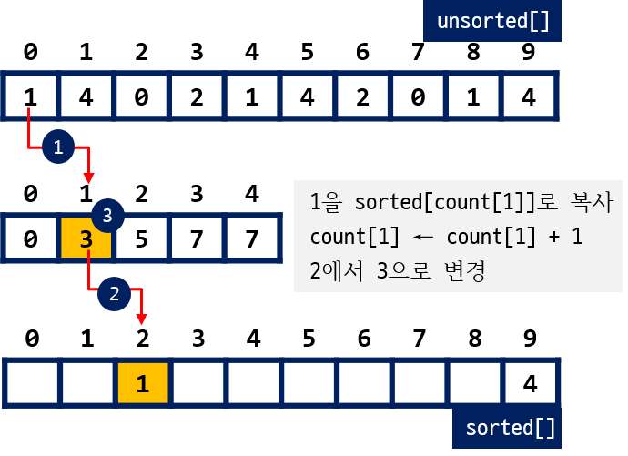

## 카운팅 정렬

!!! info "시간 복잡도"

    - **최선** $O(n+k)$
    - **최악** $O(n+k)$
    - **평균** $O(n+k)$
    
    **n** 은 자료수, **k** 는 자료의 최대값

--------------
    
### 마지막 자료부터 옮기기

{: width="60%" height="60%"}

*< 빈도수 계산하기 >*

{: width="60%" height="60%"}

*< 빈도수 누적하기 >*

{: width="60%" height="60%"}
 
*< 끝에 위치한 unsorted[N-1] 옮기기 >*


{: width="60%" height="60%"}
   
*< unsorted[N-2] 옮기기 >*


#### 예제 코드

??? settings "Counting Sort" 
    === "python"
        ``` python

        ```
    === "C"
        ``` C
        #include <stdio.h>

        const int MAX = 4;  	        // 최대값
        const int N = 10;               // 자료수
        int unsorted[N] = {1, 4, 0, 2, 1, 4, 2, 0, 1, 4};
        int count[MAX + 1];             // 자료값의 범위는 0 에서 최대값
        int sorted[N];                  // 정렬된 자료 저장
        void countingSort(int n, int k) {// n: 자료수, k: 최대값
            for(int i = 0; i <= k; i++)
                count[i] = 0;

            for(int i = 0; i < n; i++)
                count[unsorted[i]]++;

            for(int i = 1; i < n; i++)
                count[i] += count[i - 1];

            for(int i = n - 1; i >= 0; i--)
            {
                count[unsorted[i]]--;
                sorted[count[unsorted[i]]] = unsorted[i];
            }
        }

        int main()  {
            countingSort(N, MAX);

            for(int i = 0; i < N; i++)
                printf("%d ", sorted[i]);
            printf("\n");
            return 0;
        }
        ```


----------------

### 첫번째 자료부터 옮기기

{: width="60%" height="60%"}
   
*< 빈도수 계산하기 >*


{: width="40%" height="40%"}
   
*< 빈도수 누적하기 >*
   

{: width="60%" height="60%"}   

*< 첫번째 unsorted[0] 옮기기 >*


#### 예제 코드


??? settings "Counting Sort" 
    === "python"
        ``` python

        ```
    === "C"
        ``` C
        const int MAX = 4;              // 최대값
        const int N = 10;               // 자료수
        int unsorted[N] = {1, 4, 0, 2, 1, 4, 2, 0, 1, 4};
        int count[MAX + 1];             // 자료값의 범위는 0 에서 최대값
        int sorted[N];                  // 정렬된 자료 저장
        void countingSort(int n, int k) { // n: 자료수, k: 최대값
            for(int i = 0; i <= k; i++)
                count[i] = 0;

            for(int i = 0; i < n; i++)
                count[unsorted[i]]++;

            int sum = 0;
            for(int i = 0; i < n; i++)
            {
                int prev = count[i];
                count[i] = sum;
                sum += prev;
            }

            for(int i = 0; i < n; i++)
            {
                sorted[count[unsorted[i]]] = unsorted[i];
                count[unsorted[i]]++;
            }
        }
        ```